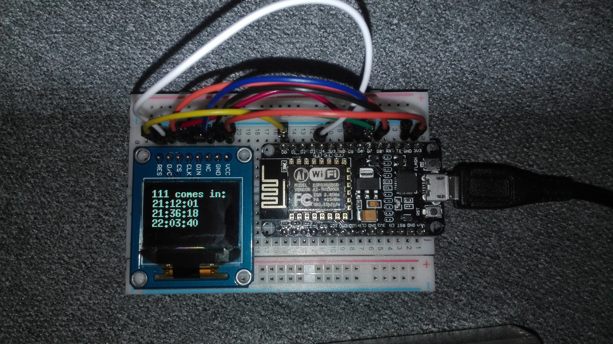

# sofia-city-transport-timing-widget

Embedded device for home usage,
fetching data from Sofia city-transport API and showing timetable on oled display.

Using NodeMcu http://nodemcu.com
and SSD-1331 oled display

Using API endpoints, exposed here: https://github.com/ivkos/Sofia-Public-Transport-API

# Wiring:

	

NodeMcu pins	->	SSD-1331 pins

GPIO16 (D0)		-> RES

GPIO2 (D4)		-> D/C

GPIO15 (D8)		-> CS

GPIO14 (D5)		-> CLK

GPIO13 (D7)		-> DIN

GPIO12 (D6)		-> NC

GND				-> GND

3V3				-> VCC

# Configuration:
Before uploading the file, configurate your wifi network at src/config.json

# Firmware:

Using Lua firmware for nodemcu, built here: http://nodemcu-build.com/
with global modules: cjson, file, gpio, http, net, node, spi, tmr, uart, ucg, wifi

The binary of the firmware is imcluded in the repo.
 

For flashing, flash esp_init_data_default.bin at:
	- ESP-01, -03, -07 etc. with 512 kByte flash require 0x7c000
	- Init data goes to 0x3fc000 on an ESP-12E with 4 MByte flash
 

Flash nodemcu-master-11-modules-2016-08-11-16-28-01-float.bin at 0x00000